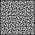
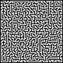

# Some example output images and text files
<pre>
# # # # # # # # # # # 
#   #               # 
#   # # # # #   #   # 
#       #       #   # 
# # #   #   # # # # # 
#       #           # 
#   # # #   # # #   # 
#   #       #       # 
#   # # # # #   #   # 
#               #   # 
# # # # # # # # # # # 
</pre>
<pre>
# # # # # # # # # # # # # # # # # # # # # 
#       #           #           #       # 
# # #   #   # # #   #   # # #   #   # # # 
#       #       #   #       #   #       # 
#   # # # # #   #   # # #   #   # # #   # 
#               #   #       #           # 
# # # # # # # # #   #   #   # # # # #   # 
#           #       #   #   #       #   # 
# # # # #   #   # # #   # # #   #   #   # 
#           #       #           #   #   # 
#   # # # # # # #   # # # # #   #   # # # 
#   #           #   #       #   #       # 
#   #   # # #   #   #   #   # # # # #   # 
#   #   #   #   #       #               # 
#   #   #   #   # # # # # # # # # # #   # 
#   #       #   #                   #   # 
#   # # #   #   #   #   # # # # # # #   # 
#           #   #   #           #       # 
#   # # # # #   #   # # # # #   #   # # # 
#           #               #           # 
# # # # # # # # # # # # # # # # # # # # #  
</pre>

